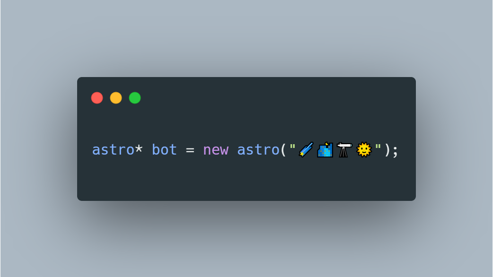

	
    <h1>astro* bot;</h1>

## Introduction
`astro* bot;`† (pronounced as _astro pointer bot_) is a simple and easy-to-use telegram bot that provides you with stargazing and astronomical information.

## How to use?
Make sure you have a telegram user account. Send the command `/start` to `astro* bot;` at [@AstroPointerBot](https://t.me/AstroPointerBot), and you will be greeted with some instructions.

Alternatively, you may refer to a [full tutorial](https://github.com/ChoiTommy/astro-pointer-bot/wiki/Tutorial) on how to make the best use of this bot, or go through the [documentation page](https://github.com/ChoiTommy/astro-pointer-bot/wiki/Documentations) in the wiki.

## Key features

### Star map (sky chart)
Wanna know which constellations you are looking at above the sky? Fret not, a star map comes in handy in such a situation. The bot can send you a star map (or sky chart) based on the location you set with the bot initially on demand. Simply send the command `/starmap` to configure your settings, or `/starmap -s` to retrieve the star map right away. 

### Astronomical data
Get some insights into the current astronomical data of the set location. It can be triggered with the command `/astrodata`. Believe me, you won't miss out on any precious time to see the sunrise/sunset with your beloved ones.

### Weather data
Meteorology and astronomy are completely different things, but one may affect the observation of the other. Know the weather well before setting out for a stargazing trip. Type in `/weather` to the bot to get the weather data of the set location.

### Sun images
Astronomy is not just about the night sky. Our #1 energy source, the Sun, is also worth looking at too. The bot can send you a gorgeous while up-to-date sun image (usually captured every 15 mins) with the command `/sun`.  

### ISS live location
Do you know that the International Space Station (ISS) orbits around the Earth 90 mins per revolution? Super fast, ain't it? The `/iss` command is here to help you follow it closely as if you were a creature standing at a distance far away from the Earth, watching it orbits around our planet.

### Subscriptions
Feeling like you want to be notified rather than asking for information on demand? The `/sub features timings` command is here to help you. You can subscribe to any of the above features/commands to receive notifications whenever you like. You can also unsubscribe by sending the command `/unsub features`. Read the [tutorial](https://github.com/ChoiTommy/astro-pointer-bot/wiki/Tutorial) for more information on the subscription system.

## Credits
- [Skyandtelescope](https://skyandtelescope.org)
- [WeatherAPI](https://www.weatherapi.com)
- [NASA SDO Data](https://sdo.gsfc.nasa.gov/data/)
- [Python telegram bot](https://github.com/python-telegram-bot/python-telegram-bot)
- [Google material icons](https://fonts.google.com/icons)

---
† Sidenotes:
The name of this project/bot is obviously inspired by the C/C++ language. Now, you might be wondering, why wasn't this project in C/C++? Well, glad you asked. The reason is that Python is easier to learn and use for a novice like myself. In hindsight, CPython is built on top of C. So yeah, I can _C_ the relationship between this name and Python :)